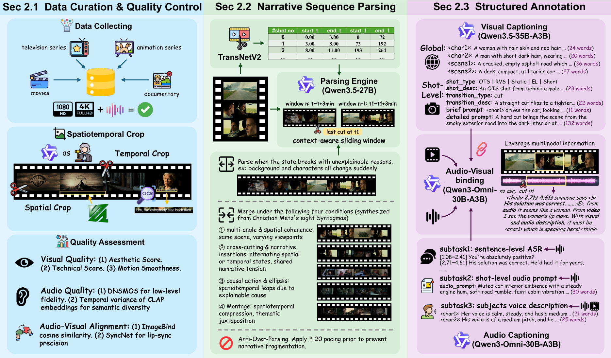
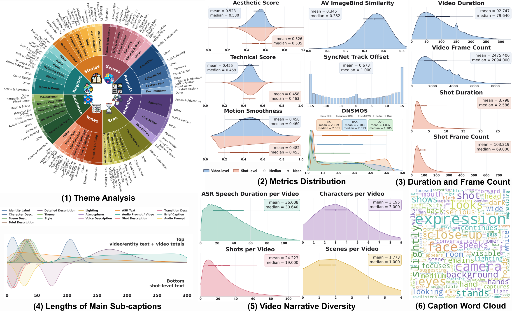
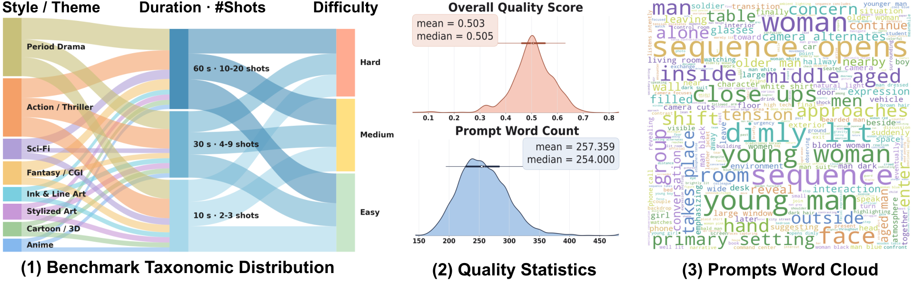

<div align="center">

<h1>CineDance: Towards Next-Generation Multi-Shot Long-Form Cinematic Audio-Video Generation</h1>

<p>
  Yuheng Chen<sup>1,*</sup> &nbsp;
  Teng Hu<sup>1,*</sup> &nbsp;
  Yuji Wang<sup>1</sup> &nbsp;
  Qingdong He<sup>2</sup> &nbsp;
  Zhucun Xue<sup>3</sup> &nbsp;
  Qianyu Zhou<sup>4</sup> &nbsp;
  Xiangtai Li<sup>5</sup> &nbsp;
  Lizhuang Ma<sup>1,&dagger;</sup> &nbsp;
  Jiangning Zhang<sup>3,&Dagger;</sup> &nbsp;
  Dacheng Tao<sup>6</sup>
</p>

<p>
  <sup>1</sup>Shanghai Jiao Tong University &nbsp;&nbsp;
  <sup>2</sup>University of Electronic Science and Technology of China &nbsp;&nbsp;
  <sup>3</sup>Zhejiang University &nbsp;&nbsp;
  <sup>4</sup>Nanjing University of Science and Technology &nbsp;&nbsp;
  <sup>5</sup>University of Tokyo &nbsp;&nbsp;
  <sup>6</sup>Nanyang Technological University
</p>

<p>
  <sup>*</sup>Equal contribution &nbsp;&nbsp;
  <sup>&dagger;</sup>Corresponding author &nbsp;&nbsp;
  <sup>&Dagger;</sup>Project lead
</p>

<div align="center">
  <a href="https://aliothchen.github.io/projects/CineDance/"></a> &ensp;
  <a href="https://arxiv.org/abs/2606.09639"></a> &ensp;
  <a href="https://arxiv.org/pdf/2606.09639"></a> &ensp;
  <a href="https://github.com/AliothChen/CineDance"></a>
</div>

</div>

---

## ✨ Introduction

CineDance is a framework towards next-generation multi-shot long-form cinematic audio-video generation. It bridges the gap between commercial systems and open-source models by addressing the critical shortage of high-quality training data for cinematic video generation. CineDance introduces three key components: the **CineDance-1M** large-scale dataset, the **CineBench** evaluation benchmark, and the **CineDance model** adapted from LTX-2.3, collectively advancing open-source research on multi-shot long-form joint audio-video generation.

## 🔥 Highlights

| Component | Purpose |
| --- | --- |
| CineDance-1M | A 1M-sequence cinematic dataset with 1080p resolution, long-form multi-shot sequences, full native audio, and structured dual-modality annotations. |
| CineBench | A 1,000-case benchmark with six-dimension human-aligned metrics for evaluating multi-shot long-form audio-video generation. |
| CineDance Model | An open-source baseline model adapted from LTX-2.3 for multi-shot long-form audio-video generation. |
| Three-stage data governance pipeline | Diverse collection & cleaning → Cinematic narrative parsing → Hierarchical dual-modality annotation. |
| Visual-temporal reference scaffolds | Training strategy that gradually removes scaffolds to retain multi-shot organization ability at inference. |

## 🎬 Visual Showcase

<p align="center">
  
</p>

## 🧠 Pipeline Overview

<p align="center">
  
</p>

## 📊 Dataset Quality

<p align="center">
  
</p>

## 📈 Benchmark

<p align="center">
  
</p>

## 📢 News

- 2026-06-01: Paper released on arXiv.

## 🗓️ Timeline

- [x] Release paper
- [x] Release project page
- [ ] Release CineDance-1M dataset (gated access)
- [ ] Release curation pipeline code
- [ ] Release inference suite
- [ ] Release inference code
- [ ] Release model checkpoint
- [ ] Release training code

## 🚀 Getting Started

The inference code, model checkpoints, training code, and CineDance-1M dataset will be released in this repository. The dataset (over 80 TB) is currently undergoing processing and will be released via a gated access mechanism. Please follow the timeline above for release status.

## 🙏 Acknowledgements

We gratefully thank the authors of [Lightricks/LTX-2](https://github.com/Lightricks/LTX-2), [QwenLM/Qwen3.6](https://github.com/QwenLM/Qwen3.6), [QwenLM/Qwen3-Omni](https://github.com/QwenLM/Qwen3-Omni), and [vllm-project/vllm](https://github.com/vllm-project/vllm) for their excellent open-source codebases.

## 📚 Citation

If you find this work useful for your research, please consider citing:

```bibtex
@misc{chen2026cinedancenextgenerationmultishotlongform,
      title={CineDance: Towards Next-Generation Multi-Shot Long-Form Cinematic Audio-Video Generation}, 
      author={Yuheng Chen and Teng Hu and Yuji Wang and Qingdong He and Zhucun Xue and Qianyu Zhou and Xiangtai Li and Lizhuang Ma and Jiangning Zhang and Dacheng Tao},
      year={2026},
      eprint={2606.09639},
      archivePrefix={arXiv},
      primaryClass={cs.CV},
      url={https://arxiv.org/abs/2606.09639}, 
}
```
